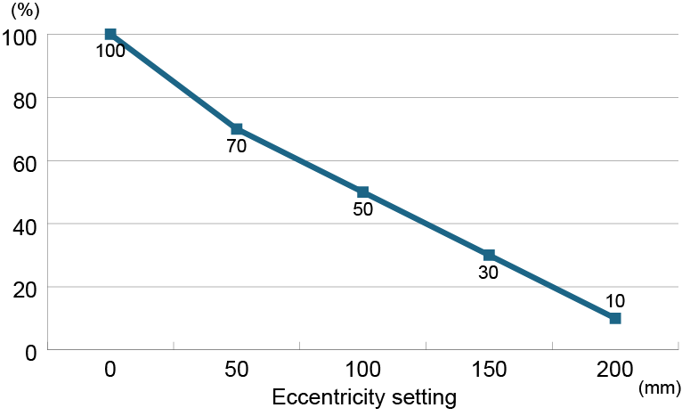
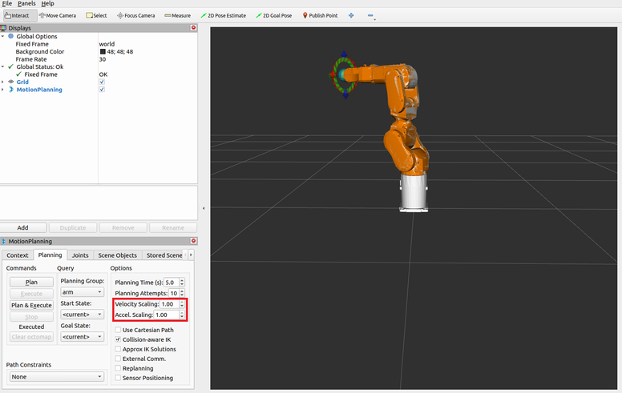

# Epson Robot ROS 2 Package

[日本語](./readme_ja.md) / [English](./readme.md)

## 1. Introduction to the Epson Robot ROS 2 Package

This package provides the following:

- Communications node with an Epson controller
- MoveIt 2 configuration file
- URDF

You can control an Epson robot using MoveIt 2 and ros2_control.

Demo programs using MoveIt 2 and ros2_control are also available in this package. Use these demo programs as necessary.

### 1.1 Precautions

MoveIt 2 and ros2_control are not in the package provided by Epson. Make sure that you fully understand these packages before using this package.

## 2. Required Equipment

- Epson industrial robot

    For the robots that can be used, see [Supported Models](#21-supported-models).
- Epson robot controller

    This package can be used with the RC800 controller (Ver. 8.1.1.0 or higher). Purchase and enable the "Real-time Motion Control" controller option in advance. For details, refer to the following manual.  
    "Epson RC+ 8.0 User's Guide"
- Windows PC and USB cable

    Install Epson RC+ 8.0 and configure the settings to use this package in the controller.

    Connect this PC to the controller with the USB cable. The USB Type-B connector is located on the controller side for connecting to the PC.
- Epson RC+ 8.0 (Ver. 8.1.1.0 or higher)

    Epson RC+ 8.0 is a Windows application that provides an integrated development environment for Epson robots. You must configure the controller settings to use this package.
- Linux PC and Ethernet cable

    This equipment is required to use this package. For the recommended environment, see [Recommended Environment for the Linux PC](#22-recommended-environment-for-the-linux-pc).

    You must connect this PC to the controller with the Ethernet cable.
- Other equipment required to use the industrial robot

    Make sure to connect the safeguard and emergency stop button to the controller.

### 2.1 Supported Models

Real-time motion control is available for the following models.

**SCARA robot**

- GX4-C251S
- GX4-C301S
- GX4-C351S
- GX4-C351S-L
- GX4-C351S-R

**6-axis robot**

- C8-C901S
- C8-C1401S
- C12-C1401S

### 2.2 Recommended Environment for the Linux PC

The recommended environment for the Linux PC that uses this package are listed below. Operation is not guaranteed on all PCs.

- OS: Ubuntu22.04LTS
- ROS2 Version: Humble
- CPU: Intel Core i7 or higher
- Memory: 16 GB or more

## 3. Building the Environment on the Linux PC to Use the Epson ROS 2 Package

The Epson ROS 2 package issues commands to the controller and robot using the client library for real-time motion control provided by Epson. Follow the instructions listed below before using this package.  
"https://github.com/Epson-Robots/rtmc-client-library.git - Building the Environment on the Linux PC to Use the Client Library"

This package links the client library specified by the above path. If you changed the install path when the client library was built, you must change CMakeList.txt for this package.

1. Install ROS2.

    Install ROS 2 by following the ROS 2 Humble tutorial. For details, refer to the following website:  
    https://docs.ros.org/en/humble/Installation/Ubuntu-Install-Debs.html

2. Install rosdep.

    ```shell-session
    sudo apt install python3-rosdep
    ```

3. Clone this package in your home directory with git clone.

    ```shell-session
    git clone https://github.com/Epson-Robots/epson-robot-ros2.git
    ```

4. Resolve the dependencies.

    ```shell-session
    sudo apt update
    rosdep install --ignore-src -y --rosdistro humble --from-paths epson-robot-ros2
    ```

5. Build the workspace.

    ```shell-session
    cd epson-robot-ros2
    colcon build
    source install/setup.sh
    ```

## 4. Setting Up the Controller

Configure the controller settings to use this package.

For details on the configuration instructions, refer to the following manual:  
"Epson RC+ 8.0 User's Guide - Real-time Motion Control"

## 5. Using the Epson Robot ROS 2 Package

### 5.1 Starting and Stopping the ROS 2 Node

Follow the steps below for the Linux PC. Complete  before these steps.

1. Set the IP address of the Linux PC to be on the same network as the controller.
2. Connect the Linux PC to the controller with the Ethernet cable.
3. Turn on the controller.
4. Wait until only the "AUTO" LED on the controller is flashing.
5. Open the ROS 2 workspace installed by this package on the Linux PC in a terminal, and run the following command. The options are listed later. <sup>\*</sup>

    ```shell-session
    $ ros2 launch epson_robot_bringup epson_robot.launch.py <options>
    ```
6. Press Ctrl-C in the opened terminal to stop the ROS 2 node.

<sup>\*</sup> Set LD_LIBRARY_PATH and other environment variables so that the client library can be loaded.

### 5.2 ROS 2 Node Start Options

|Item |Description |Default Value|
|--|--|--|
|use_fake_hardware |Starts in the mode to operate the robot only in RViz without controller communications. |false|
|launch_rviz |Starts RViz. |true|
|controller_ip |Specifies the destination controller's IP address. Use this option when the controller's IP address is changed<sup>\*1</sup>. |192.168.0.1|
|controller_port |Specifies the destination controller's port number. Use this option when the controller's port number for built in messaging was changed<sup>\*1</sup>. |7000|
|security |Secures communications with the controller. Use this option when secure communications is enabled in the controller<sup>\*1</sup>. |false|
|client_ip |Explicitly specifies the Linux PC's NIC. |-|
|client_builtinmsg_port |Explicitly specifies the Linux PC's port number for built in messaging. |-|
|client_userdata_port |Explicitly specifies the Linux PC's port number for user data. |-|
|send_format |Specifies the motion control type. <sup>\*2</sup> |0|
|recv_format |Specifies the current value type. <sup>\*3</sup> |0|
|rb_model |Specifies the robot model. This option is required. |-|
|weight |Specifies the weight of the end effector mounted to the robot (unit: kg, can be specified as a decimal). <sup>\*4</sup> |Default|
|inertia |Specifies the load inertia of the end effector mounted to the robot (unit: kgm^2, can be specified as a decimal). <sup>\*4</sup> |Default|
|eccentricity |Specifies the eccentricity of the end effector mounted to the robot (unit: mm, can be specified as an integer). <sup>\*4</sup> |Default|
|ca_cert |Specifies the absolute path to the CA certificate. <sup>\*5</sup> |-|
|client_cert |Specifies the absolute path to the certificate for the Linux PC application signed by the CA. <sup>\*5</sup> |-|
|key |Specifies the absolute path to the private key for the Linux PC application. <sup>\*5</sup> |-|
|governance |Specifies the absolute path to the governance document for Linux PC application. <sup>\*5</sup> |-|
|permissions |Specifies the absolute path to the permissions document for Linux PC application. <sup>\*5</sup> |-|
|password |Specifies the password to establish communications with the controller. |""|
|buffer_size |Sets the size<sup>\*6</sup> of the buffer for the motion control values to send to the controller. |5|
|namespace |Specifies the namespace of the topics and services. |epson_robot_control|
|log_lovel |Specifies the display level of the ROS log. |2|


- <sup>\*1</sup> For detailed information on the controller settings, refer to the following manual:  
    "Epson RC+ 8.0 User's Guide - Real-time Motion Control"
- <sup>\*2</sup> When you specify the motion control type as 1, you can control the standard I/O outputs in parallel with robot control. For details, see "Standard I/O Outputs" in [Topic](#532-topic).
- <sup>\*3</sup> When you specify the current value type as 1, you can control the standard I/O inputs in parallel with robot control. For details, see "Standard I/O Inputs" in [Topic](#532-topic).
- <sup>\*4</sup> The parameters related to robot motion are optimized according to the weight, load moment, and eccentricity.
- <sup>\*5</sup> For details on the security files, see [Information on the Security Files](#6-information-on-the-security-files).
- <sup>\*6</sup> When you control the robot with this package, the motion control values are first stored in a buffer inside the controller, and then the motion control values in the buffer are read out at each control cycle of the controller to control the robot. You can set the size of that buffer with this option.

An example of starting the ROS 2 node with specified options is shown below:

```shell-session
$ ros2 launch epson_robot_bringup epson_robot.launch.py rb_model:=GX4-C251S controller_ip:=192.168.0.10 controller_port:=7500 password:=user log_level:=1 weight:=3 inertia:=0.03  eccentricity:=50`
```

### 5.3 Node Information List

#### 5.3.1 Service

The following services are available when the ROS 2 node is started by following the steps in [Starting and Stopping the ROS 2 Node](#51-starting-and-stopping-the-ros-2-node). Use these services from the user program as necessary.

Each service uses the API in the client library for real-time motion control. For the functions, arguments, return values, and request acceptance conditions of each service, refer to the following information:  
"https://github.com/Epson-Robots/rtmc-client-library.git - API List"

You can use the "Related To" column in the following table to check the relationship between the API and the services. The namespace specified with namespace in [ROS 2 Node Start Options](#52-ros-2-node-start-options) is applied to "namespace" in the service names.

|Function |Service Name |Service Type |Arguments |Return Values |Related To|
|--|--|--|--|--|--|
|Matching robot model check |/"namespace"/rb_check |epson_robot_msgs/srv/RBcheck |string rb_model |int16 res |Equivalent to RBCheck function|
|Get results of matching robot model check |/"namespace"/rb_check_result |epson_robot_msgs/srv/RBCheckResult |- |int16 res |Equivalent to RBCheckResult function|
|Get robot model |/"namespace"/get_rb_model |epson_robot_msgs/srv/GetRBModel |- |int16 res <br>string rb_model |Equivalent to Get_RBModel function|
|Set motion control type |/"namespace"/set_rtmc_send_format |epson_robot_msgs/srv/SetRTMCSendFormat |uint16 rtmc_send_format |int16 res |Equivalent to Set_RTMCSendFormat function|
|Get motion control type |/"namespace"/get_rtmc_send_format |epson_robot_msgs/srv/GetRTMCSendFormat |- |int16 res <br>uint16 rtmc_send_format |Equivalent to Get_RTMCSendFormat function|
|Set current value type |/"namespace"/set_rtmc_recv_format |epson_robot_msgs/srv/SetRTMCRecvFormat |uint16 rtmc_recv_format |int16 res |Equivalent to Set_RTMCRecvFormat function|
|Get current value type |/"namespace"/get_rtmc_recv_format |epson_robot_msgs/srv/GetRTMCRecvFormat |- |int16 res <br>uint16 rtmc_recv_format |Equivalent to Get_RTMCRecvFormat function|
|Set weight value |/"namespace"/set_weight |epson_robot_msgs/srv/SetWeight |float64 weight |int16 res |Equivalent to Set_Weight function|
|Get weight value |/"namespace"/get_weight |epson_robot_msgs/srv/GetWeight |- |int16 res <br>float64 weight |Equivalent to Get_Weight function|
|Set load inertia |/"namespace"/set_inertia |epson_robot_msgs/srv/SetInertia |float64 inertia |int16 res |Equivalent to Set_Inertia function|
|Get load inertia |/"namespace"/get_inertia |epson_robot_msgs/srv/GetInertia |- |int16 res <br>float64 inertia |Equivalent to Get_Inertia function|
|Set eccentricity |/"namespace"/set_eccentricity |epson_robot_msgs/srv/SetEccentricity |uint16 eccentricity |int16 res |Equivalent to Set_Inertia function|
|Get eccentricity |/"namespace"/get_eccentricity |epson_robot_msgs/srv/GetEccentricity |- |int16 res <br>uint16 eccentricity |Equivalent to Get_Inertia function|
|Turn on motors |/"namespace"/motor_on |epson_robot_msgs/srv/MotorOn |- |int16 res |Equivalent to MotorOn function|
|Turn off motors |/"namespace"/motor_off |epson_robot_msgs/srv/MotorOff |- |int16 res |Equivalent to MotorOff function|
|Get status of motors |/"namespace"/get_motor_status |epson_robot_msgs/srv/GetMotorStatus |- |int16 res <br>uint8 motor_status |Equivalent to Get_MotorStatus function|
|High power mode |/"namespace"/power_high |epson_robot_msgs/srv/PowerHigh |- |int16 res |Equivalent to PowerHigh function|
|Low power mode |/"namespace"/power_low |epson_robot_msgs/srv/PowerLow |- |int16 res |Equivalent to PowerLow function|
|Get power mode status |/"namespace"/get_power_mode |epson_robot_msgs/srv/GetPowerMode |- |int16 res <br>uint8 power_mode |Equivalent to Get_PowerMode function|
|Enable control mode for real-time motion control |/"namespace"/set_rtmc_mode_enable |epson_robot_msgs/srv/SetRTMCModeEnable |- |int16 res |Equivalent to Set_RTMCModeEnable function|
|Disable control mode for real-time motion control |/"namespace"/set_rtmc_mode_disable |epson_robot_msgs/srv/SetRTMCModeDisable |- |int16 res |Equivalent to Set_RTMCModeDisable function|
|Get control mode for real-time motion control |/"namespace"/get_rtmc_mode |epson_robot_msgs/srv/GetRTMCMode |- |int16 res <br>uint8 rtmc_mode |Equivalent to Get_RTMCMode function|
|Set buffer size |/"namespace"/set_buffer_size |epson_robot_msgs/srv/SetBufferSize |uint16 buffer_size |int16 res |Equivalent to Set_BufferSize function|
|Get buffer size |/"namespace"/get_buffer_size |epson_robot_msgs/srv/GetBufferSize |- |int16 res <br>uint16 buffer_size| Equivalent to Get_BufferSize function|
|Get current values |/"namespace"/get_current_ja |epson_robot_msgs/srv/GetCurrentJA |- |int16 res <br>float64[] current_ja |Equivalent to Get_CurrentJA function|
|Reset |/"namespace"/reset |epson_robot_msgs/srv/Reset |- |int16 res |Equivalent to Reset function|
|Control standard I/O output in 1 bit |/"namespace"/set_digital_output_bit |epson_robot_msgs/srv/SetDigitalOutputBit |uint8 bitnum <br>uint8 bitdata uint8 |int16 res |Equivalent to Set_DigitalOutput_Bit function|
|Control standard I/O output in 1 byte |/"namespace"/set_digital_output_byte |epson_robot_msgs/srv/SetDigitalOutputByte |uint8 bytenum <br>uint8 bytedata |int16 res |Equivalent to Set_DigitalOutput_Byte function|
|Get the status of any bit number of the standard I/O output. |/"namespace"/get_digital_output_bit |epson_robot_msgs/srv/GetDigitalOutputBit |uint8 bitnum |int16 res <br>uint8 bitdata |Equivalent to Get_DigitalOutput_Bit function|
|Get the status of any byte number of the standard I/O output. |/"namespace"/get_digital_output_byte |epson_robot_msgs/srv/GetDigitalOutputByte |uint8 bytenum |int16 res <br>uint8 bytedata |Equivalent to Get_DigitalOutput_Byte function|
|Get statuses of 2 bytes of standard I/O outputs |/"namespace"/get_digital_output_word |epson_robot_msgs/srv/GetDigitalOutputWord |- |int16 res <br>uint16 worddata |Equivalent to Get_DigitalOutput_Word function|
|Get the status of any bit number of the standard I/O input. |/"namespace"/get_digital_input_bit |epson_robot_msgs/srv/GetDigitalInputBit |uint8 bitnum |int16 res <br>uint8 bitdata |Equivalent to Get_DigitalInput_Bit function|
|Get the status of any byte number of the standard I/O input. |/"namespace"/get_digital_input_byte |epson_robot_msgs/srv/GetDigitalInputByte |uint8 bytenum |int16 res <br>uint8 bytedata |Equivalent to Get_DigitalInput_Byte function|
|Get the status of any Word number of the standard I/O input. |/"namespace"/get_digital_input_word |epson_robot_msgs/srv/GetDigitalInputWord |uint8 wordnum |int16 res <br>uint16 worddata |Equivalent to Get_DigitalInput_Word function|
|Terminate ROS 2 node |/"namespace"/terminate |epson_robot_msgs/srv/Terminate |- |- |-|

#### 5.3.2 Topic

**Robot controller status**

The ROS 2 node provided by Epson can publish the following topic when the ROS 2 node is started by following the steps in [Starting and Stopping the ROS 2 Node](#51-starting-and-stopping-the-ros-2-node). Subscribe to this topic in the user program as necessary. The topic is published only when the robot controller's status changes.

The /"namespace"/rc_status topic publishes the controller information acquired with the Get_RCStatus function. For details on the Get_RCStatus function, refer to the following information:  
"https://github.com/Epson-Robots/rtmc-client-library.git - API List - Get_RCStatus"

The namespace specified with namespace in [ROS 2 Node Start Options](#52-ros-2-node-start-options) is applied to "namespace" in the topic name.

- Topic name

    /"namespace"/rc_status
- Message type

    epson_robot_msgs/msg/RcStatus
- Message contents
    - uint8 safeguard
    - uint8 estop
    - uint16 operation_mode
    - uint16 err_num
    - uint16 wrn_num
    - int32 err_add_info1
    - int32 err_add_info2
    - uint16 err_jnt
    - string err_msg
    - int32 wrn_add_info1
    - int32 wrn_add_info2
    - uint16 wrn_jnt
    - string wrn_msg

**Standard I/O inputs**

When you specify 1 for recv_format in [ROS 2 Node Start Options](#52-ros-2-node-start-options), you can get the statuses of the standard I/O inputs in the user program in parallel with robot control. The statuses of the standard I/O inputs are published in the /"namespace"/digital_input_common topic. The details of the topic are as follows:

- Topic name

    /"namespace"/digital_input_common
- Message type

    epson_robot_msgs/msg/DigitalInputCommon
- Message contents

    uint32 worddata

The statuses of the standard I/O inputs in 3 bytes are published in a worddata message as a decimal number. For example, when the 3rd, 15th, and 21st bits of the standard I/O inputs are on, 2129928 is published, which is the decimal number for "0010 0000 1000 0000 0000 1000." The topic is published only when the status of a standard I/O input changes.

**Standard I/O outputs**

When you specify 1 for send_format in [ROS 2 Node Start Options](#52-ros-2-node-start-options), you can control the standard I/O outputs from the user program in parallel with robot control. To control the standard I/O outputs, publish /"namespace"/digital_output_common from the user program. The details of the topic are as follows:

- Topic name

    /epson_robot_control/digital_output_common
- Message type

    epson_robot_msgs/msg/DigitalOutputCommon
- Message contents

    uint16 worddata

Publish the commands for the standard I/O outputs in 2 bytes from the user program in a worddata message. For example, to control the 4th and 12th bits of the standard I/O outputs, publish 4112, which is the decimal number for "0001 0000 0001 0000."

### 5.4 Steps to Start and Stop Robot Control

**!!!CAUTION!!!**

Do not create a trajectory that exceeds the maximum joint accelerations in joint_limits.yaml or the maximum angular velocities in epson_robot_property.xacro.

#### 5.4.1 Before Starting Robot Control

When moving the robot, you must adjust the maximum angular acceleration and the maximum angular velocity by taking into consideration the weight, load inertia, and eccentricity of the end effector mounted to the robot. You can calculate these values by multiplying the rated value by the adjustment ratios based on the end effector weight, load inertia, and eccentricity as shown in the following equation.

**Maximum Angular Acceleration Equation**

Max_acc'= Mac_acc * (Coef_weight * 0.001) * (Coef_eccentricity * 0.001)  * (Coef_inertia * 0.001) <sup>\*</sup>

- Max_acc' = Adjusted maximum angular acceleration
- Max_acc = Maximum angular acceleration
- Coef_weight = Adjustment ratio based on the end effector weight
- Coef_eccentricity = Adjustment ratio based on the eccentricity
- Coef_inertia = Adjustment ratio based on the load inertia

<sup>\*</sup> For the three expressions on the right side of the equation, you must consider the 4 axes of a SCARA robot and the 6 axes of a 6-axis robot when calculating the maximum angular velocity.

**Maximum Velocity Equation**

Max_vel'= Mac_vel * (Coef_weight * 0.001)

- Max_vel' = Adjusted maximum angular velocity
- Max_vel = Maximum angular velocity
- Coef_weight = Adjustment ratio based on the end effector weight

For the adjustment ratios of angular velocity and angular acceleration based on end effector weight, refer to the manual for your robot model.  
- "Robot Manual - Automatic Speed Correction at Weight Setting"
- "Robot Manual - Automatic Acceleration/Deceleration Correction at Weight Setting" (Refer to the values on the vertical axis of the graph.)

For the adjustment ratios of angular velocity based on load inertia, refer to the manual for your robot model.  
"Robot Manual - Automatic Acceleration/Deceleration Correction at Inertia Setting" (Refer to the values on the vertical axis of the graph.)

For the adjustment ratios of angular acceleration based on eccentricity, refer to the manual for your robot model.  
"Robot Manual - Automatic Acceleration/Deceleration Correction at Eccentricity Setting" (Refer to the values on the vertical axis of the graph.)

Check the adjustment ratios based on the values of the weight, load inertia, and eccentricity of the end effector mounted to the robot from the graphs. <sup>\*</sup>

When moving the robot, plan the trajectory so that the motion does not exceed the adjusted maximum angular acceleration and maximum acceleration. 

<sup>\*</sup>

- The adjustment ratios vary depending on the robot model. Confirm the robot series, weight capacity, and arm length, and then confirm the adjustment ratios.
- Check the standard mode graphs.

Use the scaling for maximum angular acceleration and maximum angular velocity calculated here in [Starting Robot Control](#542-starting-robot-control).

Example: This example calculates the adjusted maximum angular acceleration assuming a SCARA robot to which an end effector is mounted with a weight of 4 kg, a load inertia of 0.03 kgm^2, and an eccentricity of 50 mm.

Since the end effector weight is 4 kg, the adjustment ratio for angular acceleration based on the end effector weight is 83 on "Example of Graph in Automatic Acceleration/Deceleration Correction at Weight Setting."

|Example of Graph in Automatic Acceleration/Deceleration Correction at Weight Setting|
|:--:|
||

Since the load inertia is 0.03 kgm^2, the adjustment ratio for angular acceleration based on the load inertia is 48 on "Example of Graph in Automatic Acceleration/Deceleration Correction at Inertia Setting."

|Example of Graph in Automatic Acceleration/Deceleration Correction at Inertia Setting|
|:--:|
||

Since the eccentricity is 50 mm, the adjustment ratio for angular acceleration based on the eccentricity is 70 on "Example of Graph in Automatic Acceleration/Deceleration Correction at Eccentricity Setting."

|Example of Graph in Automatic Acceleration/Deceleration Correction at Eccentricity Setting|
|:--:|
||

If the rated maximum angular acceleration of the robot is 35.00 [rad/s^2], then the adjusted maximum angular acceleration is the value calculated with the following equation:

35.00 * 0.83 * 0.7 = 20.34

For J4, the adjusted maximum angular acceleration is the value calculated with the following equation:

35.00 * 0.83 * 0.7 * 0.48 = 9.76

#### 5.4.2 Starting Robot Control

Start the ROS 2 node by following steps 1 to 5 in [Starting and Stopping the ROS 2 Node](#51-starting-and-stopping-the-ros-2-node). After the node is started, you can control the robot in RViz or from the user program.

When you move the robot in RViz, set Accel Scaling and Velocity Scaling in the GUI so that they are less than or equal to the scaling for maximum angular acceleration and maximum angular velocity calculated in [Before Starting Robot Control](#541-before-starting-robot-control).



When you move the robot from the user program, set Accel Scaling and Velocity Scaling in `setMaxAccelerationScalingFactor` and `setMaxVelocityScalingFactor` in MoveGroupInterface so that they are less than or equal to the scaling for maximum angular acceleration and maximum angular velocity calculated in [Before Starting Robot Control](#541-before-starting-robot-control).

### 5.4.3 Ending Robot Control

To end robot control, perform step 5 in [Starting and Stopping the ROS 2 Node](#51-starting-and-stopping-the-ros-2-node). When you end the ROS 2 node, the motors are turned off and communications are disconnected with the robot controller in a normal manner.

You can also end robot control by using the terminate ROS 2 node in [Service](#531-service) from the user program.

### 5.4.4 Restart Processing After an Exception Occurs

To restart robot motion in the user program after an error occurs in the controller, or an emergency stop or the safeguard door opening occurs, set the hardware component provided by Epson to the INACTIVATE state when these exceptions occur. Next, handle the exception that occurred, and set the hardware component to the ACTIVATE state again. Now you can restart robot motion.

For how to set the hardware component to INACTIVATE/ACTIVATE from the user program, refer to the controller_manager_activate function in the epson_moveit_except_demo.cpp demo program in this package. The state of the hardware component can also be made to transition using the following command on the command line.

**Transitioning to the INACTIVATE state**

```shell-session
ros2 service call /controller_manager/set_hardware_component_state controller_manager_msgs/srv/SetHardwareComponentState "{name: '', target_state: {id: 2, label: 'inactive'}}"
```

**Transitioning to the ACTIVATE state**

```shell-session
ros2 service call /controller_manager/set_hardware_component_state controller_manager_msgs/srv/SetHardwareComponentState "{name: '', target_state: {id: 3, label: 'active'}}"
```

**!!!WARNING!!!**

Use caution if you use this procedure because the robot will automatically restart operation.

## 6. Information on the Security Files

Use OpenSSL<sup>\*1</sup> to create the files to set for the ca_cert, client_cert, and key start options. For the files to set for governance and permissions, run create_secfile.py in the script folder<sup>\*2</sup> of the client library to create the unsigned files. Use OpenSSL<sup>\*1</sup> to sign these files.

There is a script file to create the files to set for the ca_cert, client_cert, key, governance, and permissions start options in the same folder. When you run this script file, the following folders are created, and the secure files for both the Linux PC application and the controller are created. When you use the secure files created by this script with this package, use the secure files for the Linux PC application.

```
[Folder in which the script is run]
├── [ca_cert]
│   ├── ca_cert_example.pem
│   └── ca_private_key_example.pem
├── [client_cert]
│   ├── client_cert_example.pem
│   ├── client_private_key_example.pem
│   ├── client_governance_example.smime
│   └── client_permissions_example.smime
└── [rc_cert]
    ├── rc_cert_example.pem
    ├── rc_private_key_example.pem
    ├── rc_governance_example.smime
    └── rc_permissions_example.smime
```

|Folder |File Name |Description|
|--|--|--|
|ca_cert |ca_cert_example.pem |Self-signed certificate of private CA (used by both the Linux PC application and the controller)|
|ca_cert |ca_private_key_example.pem |Private key of private CA|
|client_cert |client_cert_example.pem |Signing certificate for Linux application|
|client_cert |client_private_key_example.pem |Private key for Linux application|
|client_cert |client_governance_example.smime |Governance document for Linux application|
|client_cert |client_permissions_example.smime |Permissions document for Linux application|
|rc_cert |rc_cert_example.pem |Signing certificate for controller|
|rc_cert |rc_private_key_example.pem |Private key for controller|
|rc_cert |rc_governance_example.smime |Governance document for controller|
|rc_cert |rc_permissions_example.smime |Permissions document for controller|

- <sup>\*1</sup> OpenSSL is opensource software. For details, refer to the following website.  
https://openssl-library.org/
- <sup>\*2</sup> For the script folder in the client library, refer to the following information.  
https://github.com/Epson-Robots/rtmc-client-library/script.git

## 7. Using the Demo Programs

This package has two types of demo programs.

- Standard demo: A demo program using MoveIt and ros2_control that moves the robot.
- Exception handling demo: A demo program using MoveIt and ros2_control that restarts robot motion after an emergency stop, safeguard door opening, or error.

Run the demo programs as described below.

The following example runs the standard demo for the GX4-C251S to perform five pick and place operations with AccelScaling set to 0.8 and VelocityScaling set to 0.8.

This example shows running the program when the GX4-C251S is operated by the standard demo program.

 ```shell-session
  ros2 launch epson_robot_demo epson_moveit_demo.launch.py rb_model:=GX4-C251S acc_factor:=0.8 vel_factor:=0.8 number_cycles:=5
 ```

The demo program start arguments are listed below.

|Item |Description |Default Value|
|--|--|--|
|rb_model |Specifies the robot model to control. |-|
|acc_factor |Specifies the AccelScaling Factor to set with the MoveIt API. |1.0|
|vel_factor |Specifies the VelocityScaling Factor to set with the MoveIt API. |1.0|
|number_cycles |Specifies the number of pick and place cycles. |3.0|

## 8. Troubleshooting

The Epson ROS 2 package issues commands to the controller and robot using the client library for real-time motion control provided by Epson. If a command to the controller and robot fails, the error message, name of the API function that failed, and function's return value are output to the ROS log<sup>\*</sup>. For troubleshooting, refer to the following information:  
"https://github.com/Epson-Robots/rtmc-client-library.git - API Return Values"

If an error occurs in the controller, the error message, error number, additional information, and axis are output to the ROS log<sup>\*</sup>. For details on errors, refer to the following manual:  
"Epson RC+ 8.0 Status Code / Error Code List"

<sup>\*</sup> The ROS log is output to ~/.ros/log.
