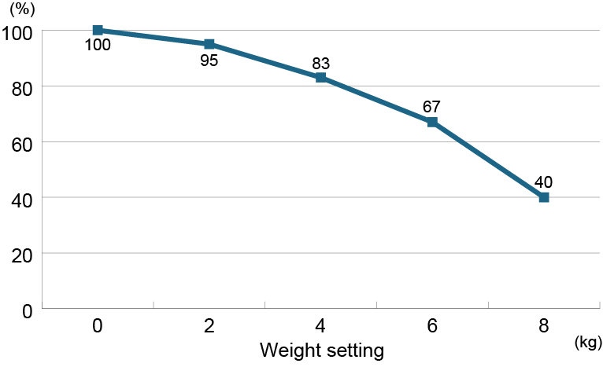
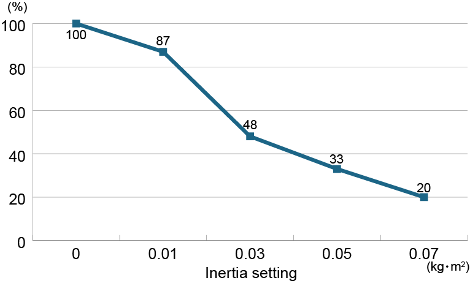
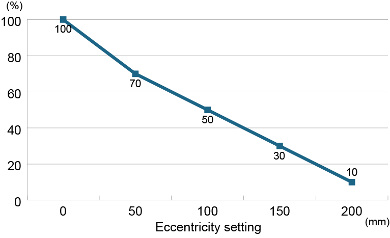
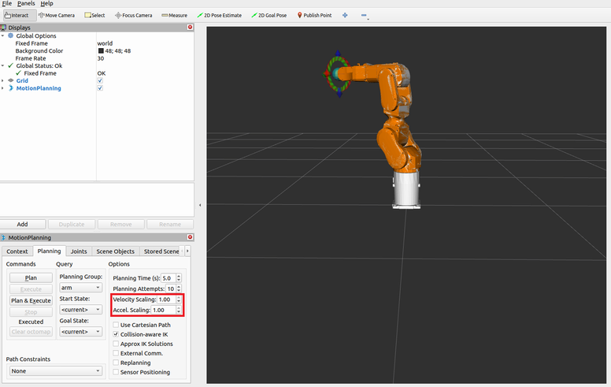

# エプソンロボット ROS2パッケージ

[日本語](./readme_ja.md) / [English](./readme.md)

## 1. エプソンロボットROS2パッケージについて

このパッケージは、以下を提供します。

- エプソンのコントローラーとの通信用ノード
- MoveIt!2構成ファイル
- URDF

MoveIt2!とROS2 Controlを利用して、エプソンのロボットを制御できます。

本パッケージには、MoveIt2!とROS2 Controlを利用したデモプログラムも用意されています。必要に応じてご利用ください。

### 1.1 注意事項

MoveIt!2とROS2 Controlは、エプソンが提供するパッケージではありません。これらのパッケージをよく理解した上で、本パッケージを使用してください。

## 2. 必要な機材

- エプソン製産業用ロボット

    使用できる機種について詳細は、[対応機種](#21-対応機種)を参照してください。
- エプソン製ロボットコントローラー

    本パッケージはコントローラーRC800 (Ver 8.1.1.0以上)で利用できます。事前に、コントローラーオプション"Real-time Motion Control"を購入、有効化します。詳細は以下を参照してください。  
    "Epson RC+ 8.0 ユーザーズガイド"
- Windows PC、USBケーブル

    Epson RC+ 8.0をインストールして、コントローラーに本パッケージを使用するための設定をします。

    このPCとコントローラーはUSBケーブルで接続します。コントローラー側のPC接続用コネクターは、USB Type-Bです。
- Epson RC+ 8.0 (Ver 8.1.1.0以上)

    Epson RC+ 8.0は、エプソン製ロボットの統合開発環境であるWindowsアプリケーションです。コントローラーに対して本パッケージを利用するための設定に必要です。
- Linux PC、イーサネットケーブル

    本パッケージを利用するのに必要です。推奨環境は、[Linux PCの推奨環境](#22-linux-pcの推奨環境)参照してください。

    このPCとコントローラーはイーサネットケーブルで接続する必要があります。
- その他産業用ロボットに必要な環境

    コントローラーに安全扉と非常停止ボタンを必ず接続してください。

### 2.1 対応機種

本パッケージに対応する機種は以下の機種です。この機能を使用するには、以下のバージョン条件を満たしている必要があります。

- ROS2パッケージ: 1.1.0以上
- クライアントライブラリー: 1.1.0以上
- コントローラーRC800: 8.1.2.0以上

以下の機種一覧で <sup>\*</sup> がついている機種は、以下のバージョン条件を満たしている必要があります。

- ROS2パッケージ: 1.0.0以上
- クライアントライブラリー: 1.0.0以上
- コントローラーRC800: 8.1.1.0以上

**スカラロボット**

|シリーズ|機種|
|--|--|
|GX4シリーズ|GX4-C251S<sup>\*</sup>, GX4-C251C<br>GX4-C301S<sup>\*</sup>, GX4-C301SM, GX4-C301C, GX4-C301CM <br>GX4-C351S<sup>\*</sup>, GX4-C351SM, GX4-C351C, GX4-C351CM<br>GX4-C351S-L<sup>\*</sup>, GX4-C351C-L, GX4-C351S-R<sup>\*</sup>, GX4-C351C-R|
|GX8シリーズ|GX8-C452S, GX8-C452SR, GX8-C452C, GX8-C452CR<br>GX8-C453S, GX8-C453SR, GX8-C453C, GX8-C453CR<br>GX8-C552S, GX8-C552SR, GX8-C552C, GX8-C552CR<br>GX8-C553S, GX8-C553SR, GX8-C553C, GX8-C553CR<br>GX8-C652S, GX8-C652SR, GX8-C652C, GX8-C652CR<br>GX8-C653S, GX8-C653SR, GX8-C653C, GX8-C653CR|
|RSシリーズ|RS4-C351S, RS4-C351C<br>RS6-C552S, RS6-C552C|

**6軸ロボット**

|シリーズ|機種|
|--|--|
|C8シリーズ|C8-C901S<sup>\*</sup>, C8-C901SR, C8-C901C, C8-C901CR<br>C8-C1401S<sup>\*</sup>, C8-C1401SR, C8-C1401C, C8-C1401CR|
|C12シリーズ|C12-C1401S<sup>\*</sup>,C12-C1401C|
|CX4シリーズ|CX4-A601S, CX4-A601SR, CX4-A601C, CX4-A601CR|
|CX7シリーズ|CX7-A701S, CX7-A701SR, CX7-A701C, CX7-A701CR<br>CX7-A901S, CX7-A901SR, CX7-A901C, CX7-A901CR|

### 2.2 Linux PCの推奨環境

本パッケージを利用するLinux PCの推奨環境は以下の通りです。すべてのPCでの動作を保証するものではありません。

- OS: Ubuntu22.04LTS
- ROS2 Version: Humble
- CPU: Intel Core i7以上
- メモリー: 16GB以上

## 3. エプソン ROS2パッケージを利用するためのLinux PCの環境構築手順

エプソンROS2パッケージでは、弊社が提供するリアルタイム動作指令用クライアントライブラリーを使用して、コントローラー/ロボットに対して指示を行います。事前に以下の内容を実施してください。  
"https://github.com/Epson-Robots/rtmc-client-library.git - クライアントライブラリーを利用するためのLinux PCの環境構築手順"

本パッケージでは、上記に記載したパスを指定してクライアントライブラリーをリンクします。そのため、クライアントライブラリーのビルド時にインストールパスを変更したときは、本パッケージのCMakeList.txtを変更する必要があります。

1. ROS2をインストールします。

    ROS2 Humbleのチュートリアルにしたがって、ROS2をインストールします。詳細は、以下のウェブサイトを参照してください。  
    https://docs.ros.org/en/humble/Installation/Ubuntu-Install-Debs.html

2. rosdepをインストールします。

    ```shell-session
    sudo apt install python3-rosdep
    ```

3. ホームディレクトリーに本パッケージをgit cloneします。

    ```shell-session
    git clone https://github.com/Epson-Robots/epson-robot-ros2.git
    ```

4. 依存関係を解決します。

    ```shell-session
    sudo apt update
    rosdep install --ignore-src -y --rosdistro humble --from-paths epson-robot-ros2
    ```

5. workspaceをビルドします。

    ```shell-session
    cd epson-robot-ros2
    colcon build
    source install/setup.sh
    ```

## 4. コントローラーのセットアップ

コントローラーに本パッケージを使用するための設定をします。

設定手順の詳細は、以下のマニュアルを参照してください。  
"Epson RC+ 8.0 ユーザーズガイド - リアルタイム動作指令"

## 5. エプソンロボットROS2パッケージの使い方

### 5.1 ROS2ノードの起動と終了

Linux PC側の手順を以下に示します。[コントローラーのセットアップ](#4-コントローラーのセットアップ)を事前に完了させてください。

1. Linux PCのIPアドレスをコントローラーと同じネットワークに設定します。
2. Linux PCとコントローラーをイーサネットケーブルで接続します。
3. コントローラーの電源をオンにします。
4. コントローラーのLEDが"AUTO"のみ点滅状態になるまで待ちます。
5. Linux PCの本パッケージをインストールしたROS2 workspaceでターミナルを開き、以下のコマンドを実行します。オプションについては後述します。<sup>\*</sup>

    ```shell-session
    $ ros2 launch epson_robot_bringup epson_robot.launch.py <オプション>
    ```
6. 起動したターミナルでCtrl-Cを実行すると、ROS2ノードが停止します。

<sup>\*</sup> クライアントライブラリーをロードできるように、LD_LIBRARY_PATHなどを設定してください。

### 5.2 ROS2ノード起動オプション

|項目|説明|デフォルト値|
|--|--|--|
|use_fake_hardware|コントローラーと通信せず、Rviz上のみでロボットを動作させるモードで起動します。|false|
|launch_rviz|Rvizを起動します。|true|
|controller_ip|接続先のコントローラーのIPアドレスを指定します。コントローラーのIPアドレスを変更した <sup>\*1</sup> 場合、このオプションを使用します。|192.168.0.1|
|controller_port|接続先のコントローラーのポート番号を指定します。コントローラーのビルトインメッセージ用ポート番号を変更した <sup>\*1</sup> 場合、このオプションを使用します。|7000|
|security|コントローラーとの通信をセキュア化します。コントローラーでセキュア通信を有効にした <sup>\*1</sup> 場合、このオプションを使用します。|false|
|client_ip|Linux PC側 NICを明示的に指定します。|-|
|client_builtinmsg_port|Linux PC側ビルトインメッセージ用のポート番号を明示的に指定します。|-|
|client_userdata_port|Linux PC側ユーザーデータ用のポート番号を明示的に指定します。|-|
|send_format|動作指令型を指定します。 <sup>\*2</sup>|0|
|recv_format|現在値型を指定します。 <sup>\*3</sup>|0|
|rb_model|ロボット機種を指定します。このオプションは必須です。|-|
|weight|ロボットに取りつけるハンド質量を指定します (単位: kg, 小数で指定可能)。<sup>\*4</sup>|Default|
|inertia|ロボットに取りつけるハンドの負荷イナーシャを指定します (単位: kgm^2, 小数で指定可能)。<sup>\*4</sup>|Default|
|eccentricity|ロボットに取りつけるハンドの偏心量を指定します (単位: mm, 整数で指定可能)。<sup>\*4</sup>|Default|
|ca_cert|認証局の証明書パスを絶対パスで指定します。 <sup>\*5</sup>|-|
|client_cert|認証局によって署名されたLinux PCアプリケーション用証明書を絶対パスで指定します。 <sup>\*5</sup>|-|
|key|Linux PC アプリケーション用秘密鍵を絶対パスで指定します。 <sup>\*5</sup>|-|
|governance|Linux PCアプリケーション用のガバナンスドキュメントを絶対パスで指定します。 <sup>\*5</sup>|-|
|permissions|Linux PCアプリケーション用のパーミッションドキュメントを絶対パスで指定します。 <sup>\*5</sup>|-|
|password|コントローラーと通信を確立するためのパスワードを指定します。|""|
|buffer_size|コントローラーに送信する動作指令値用のバッファーについて、サイズ <sup>\*6</sup> 設定します。|5|
|namespace|トピック、サービスの名前空間を指定します。|epson_robot_control|
|log_lovel|ROS Logの表示レベルを指定します。|2|


- <sup>\*1</sup> コントローラーの設定について詳細は、以下のマニュアルを参照してください。  
    "Epson RC+ 8.0 ユーザーズガイド - リアルタイム動作指令"
- <sup>\*2</sup> 動作指令型を1に指定すると、ロボット制御と並列して標準I/O出力が制御できます。詳しくは、[Topic](#532-topic)内の"標準I/O出力"を参照してください。
- <sup>\*3</sup> 現在値型を1に指定すると、ロボット制御と並列して標準I/O入力が取得できます。詳しくは、[Topic](#532-topic)内の"標準I/O入力"を参照してください。
- <sup>\*4</sup> 質量、負荷モーメント、偏心量に応じて、ロボット動作に関わるパラメーターを最適化します。
- <sup>\*5</sup> セキュリティファイルの詳細は、[セキュリティファイルについて](#6-セキュリティファイルについて)を参照してください。
- <sup>\*6</sup> 本パッケージを利用してロボットを制御する場合、コントローラー内では、動作指令値を一度バッファーに格納し、コントローラーの制御周期ごとにバッファーの動作指令値を読み出し、ロボットを制御します。このオプションで、そのバッファーのサイズを設定できます。

オプションを指定したROS2ノードの起動例は以下の通りです。

```shell-session
$ ros2 launch epson_robot_bringup epson_robot.launch.py rb_model:=GX4-C251S controller_ip:=192.168.0.10 controller_port:=7500 password:=user log_level:=1 weight:=3 inertia:=0.03  eccentricity:=50`
```

### 5.3 ノード情報一覧

#### 5.3.1 Service

[ROS2ノードの起動と終了](#51-ros2ノードの起動と終了)の手順にしたがってROS2ノードを起動すると、以下のサービスが利用できるようになります。必要に応じて、ユーザープログラムから使用してください。

各サービスは、リアルタイム動作指令用クライアントライブラリーのAPIを利用します。各サービスの機能内容/引数/戻り値/要求受付条件に関しては、以下を参照してください。  
"https://github.com/Epson-Robots/rtmc-client-library.git - API一覧"

サービスとAPIの関係は、下表の"対応関係"列で確認できます。サービス名の"namespace"には、[ROS2ノード起動オプション](#52-ros2ノード起動オプション)のnamespaceで指定した名前空間が適用されます。

|機能|サービス名|サービス型|引数|戻り値|対応関係|
|--|--|--|--|--|--|
|ロボット機種一致確認|/"namespace"/rb_check|epson_robot_msgs/srv/RBcheck|string rb_model|int16 res|RBCheck関数に相当|
|ロボット機種一致確認の結果取得|/"namespace"/rb_check_result|epson_robot_msgs/srv/RBCheckResult|-|int16 res|RBCheckResult関数に相当|
|ロボット機種の取得|/"namespace"/get_rb_model|epson_robot_msgs/srv/GetRBModel|-|int16 res<br>string rb_model|Get_RBModel関数に相当|
|動作指令型の設定|/"namespace"/set_rtmc_send_format|epson_robot_msgs/srv/SetRTMCSendFormat|uint16 rtmc_send_format|int16 res|Set_RTMCSendFormat関数に相当|
|動作指令型の取得|/"namespace"/get_rtmc_send_format|epson_robot_msgs/srv/GetRTMCSendFormat|-|int16 res<br>uint16 rtmc_send_format|Get_RTMCSendFormat関数に相当|
|現在値型の設定|/"namespace"/set_rtmc_recv_format|epson_robot_msgs/srv/SetRTMCRecvFormat|uint16 rtmc_recv_format|int16 res|Set_RTMCRecvFormat関数に相当|
|現在値型の取得|/"namespace"/get_rtmc_recv_format|epson_robot_msgs/srv/GetRTMCRecvFormat|-|int16 res<br>uint16 rtmc_recv_format|Get_RTMCRecvFormat関数に相当|
|Weight値の設定|/"namespace"/set_weight|epson_robot_msgs/srv/SetWeight|float64 weight|int16 res|Set_Weight関数に相当|
|Weight型の取得|/"namespace"/get_weight|epson_robot_msgs/srv/GetWeight|-|int16 res<br>float64 weight|Get_Weight関数に相当|
|負荷イナーシャの設定|/"namespace"/set_inertia|epson_robot_msgs/srv/SetInertia|float64 inertia|int16 res|Set_Inertia関数に相当|
|負荷イナーシャの取得|/"namespace"/get_inertia|epson_robot_msgs/srv/GetInertia|-|int16 res<br>float64 inertia|Get_Inertia関数に相当|
|偏心量の設定|/"namespace"/set_eccentricity|epson_robot_msgs/srv/SetEccentricity|uint16 eccentricity|int16 res|Set_Inertia関数に相当|
|偏心量の取得|/"namespace"/get_eccentricity|epson_robot_msgs/srv/GetEccentricity|-|int16 res<br>uint16 eccentricity|Get_Inertia関数に相当|
|モータ励磁|/"namespace"/motor_on|epson_robot_msgs/srv/MotorOn|-|int16 res|MotorOn関数に相当|
|モータ非励磁|/"namespace"/motor_off|epson_robot_msgs/srv/MotorOff|-|int16 res|MotorOff関数に相当|
|モータ状態の取得|/"namespace"/get_motor_status|epson_robot_msgs/srv/GetMotorStatus|-|int16 res<br>uint8 motor_status|Get_MotorStatus関数に相当|
|ハイパワーモード|/"namespace"/power_high|epson_robot_msgs/srv/PowerHigh|-|int16 res|PowerHigh関数に相当|
|ローパワーモード|/"namespace"/power_low|epson_robot_msgs/srv/PowerLow|-|int16 res|PowerLow関数に相当|
|パワーモード状態の取得|/"namespace"/get_power_mode|epson_robot_msgs/srv/GetPowerMode|-|int16 res<br>uint8 power_mode|Get_PowerMode関数に相当|
|リアルタイム動作指令制御モードの有効化|/"namespace"/set_rtmc_mode_enable|epson_robot_msgs/srv/SetRTMCModeEnable|-|int16 res|Set_RTMCModeEnable関数に相当|
|リアルタイム動作指令制御モードの無効化|/"namespace"/set_rtmc_mode_disable|epson_robot_msgs/srv/SetRTMCModeDisable|-|int16 res|Set_RTMCModeDisable関数に相当|
|リアルタイム動作指令制御モードの取得|/"namespace"/get_rtmc_mode|epson_robot_msgs/srv/GetRTMCMode|-|int16 res<br>uint8 rtmc_mode|Get_RTMCMode関数に相当|
|バッファーサイズの設定|/"namespace"/set_buffer_size|epson_robot_msgs/srv/SetBufferSize|uint16 buffer_size|int16 res|Set_BufferSize関数に相当|
|バッファーサイズの取得|/"namespace"/get_buffer_size|epson_robot_msgs/srv/GetBufferSize|-|int16 res<br>uint16 buffer_size| Get_BufferSize関数に相当|
|現在値の取得|/"namespace"/get_current_ja|epson_robot_msgs/srv/GetCurrentJA|-|int16 res<br>float64[] current_ja|Get_CurrentJA関数に相当|
|リセット|/"namespace"/reset|epson_robot_msgs/srv/Reset|-|int16 res|Reset関数に相当|
|標準I/O出力を1Bit制御|/"namespace"/set_digital_output_bit|epson_robot_msgs/srv/SetDigitalOutputBit|uint8 bitnum<br>uint8 bitdata uint8|int16 res|Set_DigitalOutput_Bit関数に相当|
|標準I/O出力を1Byte制御|/"namespace"/set_digital_output_byte|epson_robot_msgs/srv/SetDigitalOutputByte|uint8 bytenum<br>uint8 bytedata|int16 res|Set_DigitalOutput_Byte関数に相当|
|標準I/O出力の任意のBit番号の状態取得|/"namespace"/get_digital_output_bit|epson_robot_msgs/srv/GetDigitalOutputBit|uint8 bitnum|int16 res<br>uint8 bitdata|Get_DigitalOutput_Bit関数に相当|
|標準I/O出力の任意のByte番号の状態取得|/"namespace"/get_digital_output_byte|epson_robot_msgs/srv/GetDigitalOutputByte|uint8 bytenum|int16 res<br>uint8 bytedata|Get_DigitalOutput_Byte関数に相当|
|標準I/O出力2Byteの状態取得|/"namespace"/get_digital_output_word|epson_robot_msgs/srv/GetDigitalOutputWord|-|int16 res<br>uint16 worddata|Get_DigitalOutput_Word関数に相当|
|標準I/O入力の任意のBit番号の状態取得|/"namespace"/get_digital_input_bit|epson_robot_msgs/srv/GetDigitalInputBit|uint8 bitnum|int16 res<br>uint8 bitdata|Get_DigitalInput_Bit関数に相当|
|標準I/O入力の任意のByte番号の状態取得|/"namespace"/get_digital_input_byte|epson_robot_msgs/srv/GetDigitalInputByte|uint8 bytenum|int16 res<br>uint8 bytedata|Get_DigitalInput_Byte関数に相当|
|標準I/O入力の任意のWord番号の状態取得|/"namespace"/get_digital_input_word|epson_robot_msgs/srv/GetDigitalInputWord|uint8 wordnum|int16 res<br>uint16 worddata|Get_DigitalInput_Word関数に相当|
|ROS2ノードのターミネイト|/"namespace"/terminate|epson_robot_msgs/srv/Terminate|-|-|-|

#### 5.3.2 Topic

**ロボットコントローラーの状態**

[ROS2ノードの起動と終了](#51-ros2ノードの起動と終了)の手順にしたがってROS2ノードを起動すると、弊社が提供するROS2ノードが以下のTopicをパブリッシュするようになります。必要に応じて、ユーザープログラムでサブスクライブしてください。パブリッシュは、ロボットコントローラーの状態が変化したときのみ実行されます。

/"namespace"/rc_statusトピックは、Get_RCStatus関数で取得したコントローラーの情報をパブリッシュします。Get_RCStatus関数の詳細は、以下を参照してください。  
"https://github.com/Epson-Robots/rtmc-client-library.git - API一覧 - Get_RCStatus関数"

トピック名の"namespace"には、[ROS2ノード起動オプション](#52-ros2ノード起動オプション)のnamespaceで指定した名前空間が適用されます。

- トピック名

    /"namespace"/rc_status
- メッセージ型

    epson_robot_msgs/msg/RcStatus
- メッセージ内容
    - uint8 safeguard
    - uint8 estop
    - uint16 operation_mode
    - uint16 err_num
    - uint16 wrn_num
    - int32 err_add_info1
    - int32 err_add_info2
    - uint16 err_jnt
    - string err_msg
    - int32 wrn_add_info1
    - int32 wrn_add_info2
    - uint16 wrn_jnt
    - string wrn_msg

**標準I/O入力**

[ROS2ノード起動オプション](#52-ros2ノード起動オプション)のrecv_formatに1を指定すると、ロボット制御と並行して標準I/O入力状態をユーザープログラムで取得できます。標準I/O入力状態は、/"namespace"/digital_input_commonトピックがパブリッシュされます。トピックの詳細は以下の通りです。

- トピック名

    /"namespace"/digital_input_common
- メッセージ型

    epson_robot_msgs/msg/DigitalInputCommon
- メッセージ内容

    uint32 worddata

メッセージとなるworddataでは、標準I/O入力の3Byteの状態を10進数でパブリッシュします。たとえば、標準I/O入力の3Bit目、15Bit目 21Bit目がONの場合、"0010 0000 1000 0000 0000 1000"の10進数となる2129928がパブリッシュされます。パブリッシュは、標準I/O入力状態が変化した時のみ実行されます。

**標準I/O出力**

[ROS2ノード起動オプション](#52-ros2ノード起動オプション)のsend_formatに1を指定すると、ロボット制御と並行して標準I/O出力をユーザープログラムから制御できます。制御するには、ユーザープログラムから/"namespace"/digital_output_commonをパブリッシュしてください。トピックの詳細は以下の通りです。

- トピック名

    /epson_robot_control/digital_output_common
- メッセージ型

    epson_robot_msgs/msg/DigitalOutputCommon
- メッセージ内容

    uint16 worddata

メッセージとなるworddataでは、標準I/O出力2Byte分に対する指令をユーザープログラムからパブリッシュしてください。たとえば、標準I/O出力の4Bit目と12Bit目を制御する場合は、"0001 0000 0001 0000"の10進数となる4112をパブリッシュしてください。

### 5.4 ロボット制御の開始および終了手順

**!!!注意!!!**

joint_limits.yamlに記載した最大角加速度や、epson_robot_property.xacroに記載した最大角速度を超過する軌道を生成しないでください。

#### 5.4.1 ロボット制御開始前

ロボットを動作させるときは、ロボットに取りつけられたハンドの質量、負荷イナーシャ、偏心量を考慮して最大角加速度と最大角速度を調整する必要があります。これは、以下の式のようにハンド質量/負荷イナーシャ/偏心量に応じた調整比率を定格値にかけ合わせることで算出できます。

**最大角加速度の算出式**

Max_acc'= Mac_acc * (Coef_weight * 0.001) * (Coef_eccentricity * 0.001)  * (Coef_inertia * 0.001) <sup>\*</sup>

- Max_acc' = 調整後の最大角加速度
- Max_acc  = 最大角加速度
- Coef_weight = ハンド質量に応じた調整比率
- Coef_eccentricity = 偏心量に応じた調整比率
- Coef_inertia = 負荷イナーシャに応じた調整比率

<sup>\*</sup> 右辺の3項目は、スカラロボットの4軸または6軸ロボットの6軸の最大角速度の算出時に考慮する必要があります。

**最大速度の算出式**

Max_vel'= Mac_vel * (Coef_weight * 0.001)

- Max_vel' = 調整後の最大角速度
- Max_vel  = 最大角速度
- Coef_weight = ハンド質量に応じた調整比率

ハンド質量に応じた角速度と角加速度の調整比率は、各ロボット機種のマニュアルを参照してください。  
- "ロボットマニュアル - Weight設定時の速度の自動補正"
- "ロボットマニュアル - Weight設定時の加減速度の自動補正" (グラフの縦軸の値を参照してください)

負荷イナーシャに応じた角加速度の調整比率は、各ロボット機種のマニュアルを参照してください。  
"ロボットマニュアル - Inertia設定時の加減速度の自動補正" (グラフの縦軸の値を参照してください)

偏心量に応じた角加速度の調整比率は、各ロボット機種のマニュアルを参照してください。  
"ロボットマニュアル - 偏心量設定時の加減速度の自動補正" (グラフの縦軸の値を参照してください)

ロボットに取りつけるハンド質量、負荷イナーシャ、偏心量の値に応じて、調整比率をグラフからご確認ください。<sup>\*</sup>

ロボットを動作させるときは、調整後の最大角加速度と最大加速度と超過しないように軌道計画を行ってください。

<sup>\*</sup>

- ロボット機種ごとに調整比率は異なります。ロボットシリーズ、可搬重量やアーム長をご確認の上、調整比率をご確認ください。
- 標準モードのグラフをご確認ください。

ここで算出した最大角加速度のスケーリングおよび最大角速度のスケーリングは、[ロボット制御開始](#542-ロボット制御開始)で利用します。

(例) 質量4kg、負荷イナーシャ0.03kgm^2、偏心量50mmのハンドが取りつけられたスカラロボットを想定し、調整後の最大角加速度を算出する例を示します。

ハンド質量が4kgのため、"Weight設定時の加減速度の自動補正に記載のグラフ(例)"からハンド質量に応じた角加速度の調整比率は、83であることが読み取れます。

|Weight設定時の加減速度の自動補正に記載のグラフ(例)|
|:--:|
||

負荷イナーシャが0.03kgm^2のため、"Inertia設定時の加減速度の自動補正に記載のグラフ(例)"から負荷イナーシャに応じた角加速度の調整比率は、48であることが読み取れます。

|Inertia設定時の加減速度の自動補正に記載のグラフ(例)|
|:--:|
||

偏心量が50mmのため、"偏心量設定時の加減速度の自動補正に記載のグラフ(例)"から偏心量に応じた角加速度の調整比率は、70であることが読み取れます。

|偏心量設定時の加減速度の自動補正に記載のグラフ(例)|
|:--:|
||

ロボットの定格の最大角加速度が35.00[rad/s^2]とすると、調整後の最大角加速度は以下の式で算出される値になります。

35.00 * 0.83 * 0.7 = 20.34

J4の場合は、整後の最大角加速度は以下の式で算出される値になります。

35.00 * 0.83 * 0.7 * 0.48 = 9.76

#### 5.4.2 ロボット制御開始

[ROS2ノードの起動と終了](#51-ros2ノードの起動と終了)の1～5の手順にしたがって、ROS2ノードを起動します。起動後、Rvizもしくはユーザープログラムからロボットを制御できます。

Rvizにてロボットを動作させるときは、GUI上のAccel Scaling、Velocity Scalingが[ロボット制御開始前](#541-ロボット制御開始前)で算出した最大角加速度、最大角速度のスケーリング以下になるように設定してください。



ユーザープログラムからロボットを動作させるときは、MoveGroupInterfaceの`setMaxAccelerationScalingFactor`、`setMaxVelocityScalingFactor`でAccel Scaling、Velocity Scalingが[ロボット制御開始前](#541-ロボット制御開始前)で算出した最大角加速度、最大角速度のスケーリング以下になるように設定してください。

### 5.4.3 ロボット制御終了

ロボット制御を終了する場合は、[ROS2ノードの起動と終了](#51-ros2ノードの起動と終了)の手順5を実施します。ROS2ノードの終了時にモータが非励磁され、ロボットコントローラーとの通信を正常に切断します。

ユーザープログラムからは、[Service](#531-service)のROS2ノードのターミネイトするサービスを利用してロボット制御を終了することもできます。

### 5.4.4 例外発生後の復帰処理

コントローラーでのエラー発生/非常停止/安全扉の開扉後に、ユーザープログラムにてロボット動作を復帰させるには、これらの例外が発生したときに、弊社が提供するハードウェアコンポーネントをINACTIVATE状態にします。その後、発生した例外に対処し、再度ハードウェアコンポーネントをACTIVATE状態にすると、ロボット動作を再開できます。

ユーザープログラムからハードウェアコンポーネントをINACTIVATE/ACTIVATEする方法は、本パッケージのデモプログラムepson_moveit_exception_demo.cppのcontroller_manager_activate関数を参照してください。また、コマンドラインからは、以下のコマンドによってハードウェアコンポーネントの状態を遷移させることが可能です。

**INACTIVATE状態への遷移**

```shell-session
ros2 service call /controller_manager/set_hardware_component_state controller_manager_msgs/srv/SetHardwareComponentState "{name: '', target_state: {id: 2, label: 'inactive'}}"
```

**ACTIVATE状態への遷移**

```shell-session
ros2 service call /controller_manager/set_hardware_component_state controller_manager_msgs/srv/SetHardwareComponentState "{name: '', target_state: {id: 3, label: 'active'}}"
```

**!!!警告!!!**

本手順を実施すると自動的にロボットが動作を再開するので、ご注意ください。

## 6. セキュリティファイルについて

起動時オプションのca_cert/client_cert/keyに設定するファイルは、OpenSSL<sup>\*1</sup> 利用して生成してください。governance/permissionsに設定するファイルは、クライアントライブラリーのscriptフォルダー <sup>\*2</sup> create_secfile.pyを実行すると署名前のファイルが生成されます。このファイルをOpenSSL<sup>\*1</sup> 利用して署名してください。

同じフォルダーに起動時オプションのca_cert/client_cert/key/governance/permissionsに設定するファイルを生成するスクリプトファイルが存在します。このスクリプトファイルを実行すると、以下のフォルダーが作成され、Linux PCアプリケーション向けとコントローラー向けの両方のセキュアファイルが生成されます。本スクリプトで生成されたセキュアファイルを本パッケージで使用する際には、Linux PCアプリケーション向けのセキュアファイルをご利用ください。

```
[スクリプトを実行するフォルダー]
├── [ca_cert]
│   ├── ca_cert_example.pem
│   └── ca_private_key_example.pem
├── [client_cert]
│   ├── client_cert_example.pem
│   ├── client_private_key_example.pem
│   ├── client_governance_example.smime
│   └── client_permissions_example.smime
└── [rc_cert]
    ├── rc_cert_example.pem
    ├── rc_private_key_example.pem
    ├── rc_governance_example.smime
    └── rc_permissions_example.smime
```

|フォルダー|ファイル名|説明|
|--|--|--|
|ca_cert|ca_cert_example.pem|プライベート認証局の自己署名証明書 (Linux PCアプリケーションとコントローラーの両方で使用)|
|ca_cert|ca_private_key_example.pem|プライベート認証局の秘密鍵|
|client_cert|client_cert_example.pem|Linuxアプリケーション用の署名証明書|
|client_cert|client_private_key_example.pem|Linuxアプリケーション用の秘密鍵|
|client_cert|client_governance_example.smime|Linuxアプリケーション用のガバナンスドキュメント|
|client_cert|client_permissions_example.smime|Linuxアプリケーション用のパーミッションドキュメント|
|rc_cert|rc_cert_example.pem|コントローラー用の署名証明書|
|rc_cert|rc_private_key_example.pem|コントローラー用の秘密鍵|
|rc_cert|rc_governance_example.smime|コントローラー用のガバナンスドキュメント|
|rc_cert|rc_permissions_example.smime|コントローラー用のパーミッションドキュメント|

- <sup>\*1</sup> OpenSSLは、オープンソースソフトウェアです。詳細は以下のウェブサイトを参照してください。  
https://openssl-library.org/
- <sup>\*2</sup> クライアントライブラリーのscriptフォルダーは、以下を参照してください。  
https://github.com/Epson-Robots/rtmc-client-library/script.git

## 7. デモプログラムの使い方

本パッケージでは、2種類のデモプログラムを用意しています。

- 標準デモ: MoveIt!とROS2 Controlを使用してロボットを動作させるデモプログラムです。
- 例外処理デモ: MoveIt!とROS2 Controlを使用して、非常停止/安全扉開扉/エラー発生後にロボット動作を復帰するデモプログラムです。

以下のようにデモプログラムを実行してください。

以下は、GX4-C251Sに対して、AccelScaling 0.8、VelocityScaling 0.8の設定値で5回Pick and Place動作を実施する標準デモを実行する例です。

GX4-C251Sを標準デモプログラム動作する際のプログラム実行例を示しています。

 ```shell-session
  ros2 launch epson_robot_demo epson_moveit_demo.launch.py rb_model:=GX4-C251S acc_factor:=0.8 vel_factor:=0.8 number_cycles:=5
 ```

デモプログラムの起動引数に関しては、以下の通りです。

|項目|説明|デフォルト値|
|--|--|--|
|rb_model|制御対象となるロボット機種を指定します。|-|
|acc_factor|MoveIt! APIで設定するAccelScaling Factorを指定します。|1.0|
|vel_factor|MoveIt! APIで設定するVelocityScaling Factorを指定します。|1.0|
|number_cycles|Pick and Placeの回数を指定します。|3.0|

## 8. トラブルシューティング

エプソン ROS2パッケージでは、弊社が提供するリアルタイム動作指令用クライアントライブラリーを使用して、コントローラー/ロボットに対して指示を行います。そのため、コントローラー/ロボットに対しての指示が失敗した場合、エラーメッセージ、実行が失敗したAPIの関数名、関数の戻り値がROS Log<sup>\*</sup> 出力されます。対処法については、以下を参照してください。  
"https://github.com/Epson-Robots/rtmc-client-library.git - APIの戻り値"

コントローラーでエラーが発生した場合には、エラーメッセージ、エラー番号、付加情報、発生軸がROS Log<sup>\*</sup> 出力されます。エラーの詳細については、以下のマニュアルを参照してください。  
"Epson RC+ 8.0 ステータスコード/エラーコード一覧"

<sup>\*</sup> ROS Logは、～/.ros/logに出力されます。
